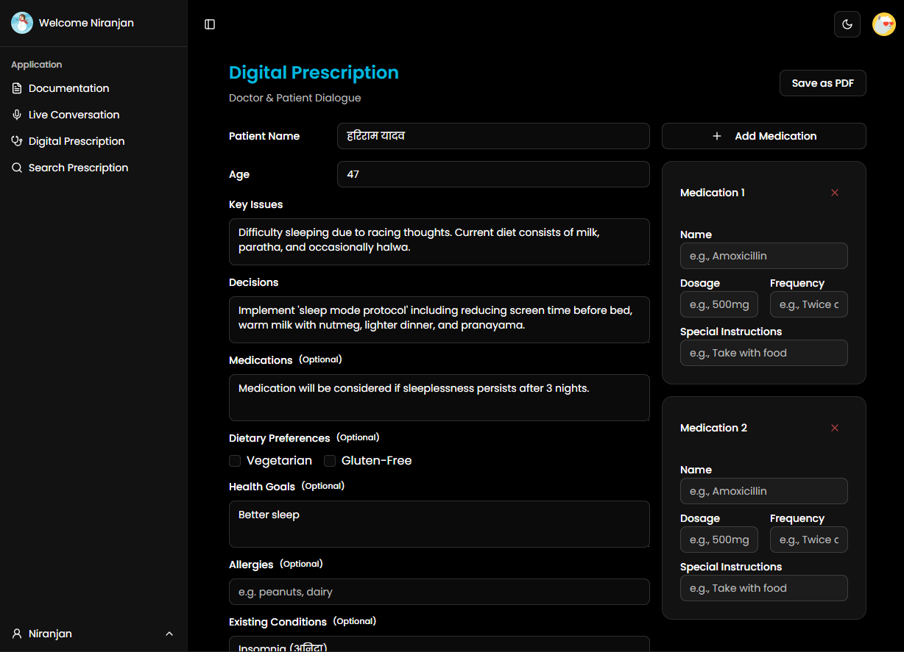
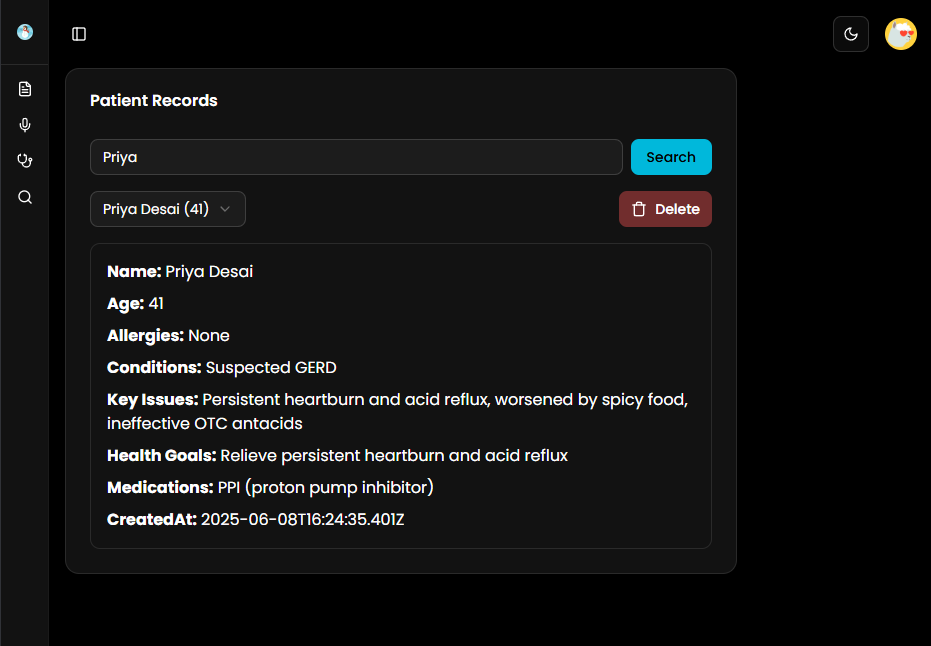

# 🏥 MediScribe – AI-Powered Multi-Agent Clinical Assistant

## 🚀 Overview
**MediScribe** is a powerful tool designed specifically for doctors and clinicians. It is an AI-first, multi-agent task automation platform that transforms natural language doctor–patient interactions into structured clinical workflows. Developed under the **OmniDimension Challenge** for **CODECLASH 2.0**, MediScribe leverages a network of intelligent agents to decompose, plan, and execute healthcare-related tasks — including real-time transcription, personalized recommendations, appointment scheduling, and calendar updates — with minimal user input.

## 🔍 Problem Statement Alignment
> **CODECLASH 2.0 – OmniDimension Track – Multi-Agent Task Automation System (Problem Statement 1)**

- Natural language task description
- Multi-agent orchestration
- Real-time execution (calls, calendar, reminders)
- External API integration (EMR, FHIR, Calendar, Telephony)

MediScribe interprets voice commands like:
> _"Schedule an appointment for stomach ache, suggest diet, generate prescription, and remind me next week."_

...and automatically activates a coordinated sequence of agents to deliver a seamless healthcare experience.

---

  
  
  
  
  



## ⚙️ Multi-Agent System Architecture

| 🧠 Agent | Role |
|---------|------|
| **Transcription Agent** | Captures voice and converts to structured medical text |
| **NLP/Analysis Agent** | Extracts clinical information: symptoms, history, diagnosis |
| **Health Insight Agent** | Generates diet plans, prescriptions, and fitness suggestions |
| **Scheduling Agent** | Finds providers and books appointments |
| **Reminder Agent** | Adds follow-up tasks to user's calendar |
| **Monitoring Agent** | Continuously checks for better slots, alerts missed updates |

---

## 🧑‍💻 Technologies Used

- **Frontend**: Next.js, Tailwind CSS, ShadCN UI
- **Backend**: Python (FastAPI + Flask)
- **AI/NLP**:
  - OmniDimension agent orchestration framework (for coordination and execution)
  - Gemini API (for transcription and language understanding)
  - MedSpaCy for clinical NLP
- **Database**: PostgreSQL (via Supabase/Prisma)
- **APIs**:
  - Calendar (Google/Microsoft)
  - Telephony (Twilio integration ready)
  - FHIR for EMR compatibility
- **Deployment**: Vercel (frontend), Render (backend)

---

## 🌐 Live Demo
🎯 [MediScribe WebApp](https://medi-scribe-pi.vercel.app/)

---

## 📦 Features

✅ **Voice Transcription** – Real-time capture and multilingual support  
✅ **Smart Clinical Notes** – Structured SOAP format generated by NLP agents  
✅ **Digital Prescriptions** – Auto-generated, editable, and downloadable  
✅ **Diet & Exercise Plans** – Personalized based on extracted symptoms and profile  
✅ **Smart Scheduling** – Appointments booked using user context and preferences  
✅ **Reminders & Monitoring** – Follow-ups, medication alerts, and re-checks  
✅ **Role-Based Access** – Separate dashboards for Doctors, Assistants, Patients  

---

## 🧱 Installation & Local Setup

```bash
# 1. Clone the Repository
$ git clone https://github.com/YourOrg/medi-scribe.git
$ cd medi-scribe

# 2. Install Frontend Dependencies
$ cd client
$ npm install

# 3. Install Backend Dependencies
$ cd ../server
$ pip install -r requirements.txt

# 4. Run Dev Servers
# Frontend (Next.js)
$ cd client
$ npm run dev

# Backend (FastAPI/Flask)
$ cd ../server
$ python app.py

# 5. Access Application
Visit http://localhost:3000
```

---

## 📈 Scalability & Business Model
- **SaaS Subscription Model**: Tiered pricing for clinics, hospitals, and solo practitioners
- **Enterprise EMR Integration**: FHIR-compliant data exchange
- **Security**: HIPAA/GDPR-ready, OAuth2.0 authentication
- **Mobile App Roadmap**: Upcoming support for iOS and Android
- **Affordable Tiers**: Free for basic users, pay-as-you-grow options

---

## 🤝 Team CODE4CHANGE
- **Vaibhav Jain** *(Team Leader)* – vaibavjain62@gmail.com
- Niranjan Praveen  
- Abhishek Chaubey  
- Debshata Choudhury 

---

## 📌 Acknowledgments
- **Gemini API** for powerful transcription and NLP assistance (used as an internal module).
- **FHIR Standard** for EMR interoperability.
- **CODECLASH 2.0 OmniDimension Challenge** for providing the platform to build impactful healthcare automation solutions.

---

## 💡 Summary
> **MediScribe** bridges the gap between doctor-patient communication and actionable care by orchestrating a network of intelligent agents. Designed for OmniDimension, it transcends traditional AI tools by embracing dynamic, coordinated, and real-time execution of healthcare workflows — empowering clinicians to focus on what matters most: delivering better care.

📌 _“From voice to care — intelligently automated.”_